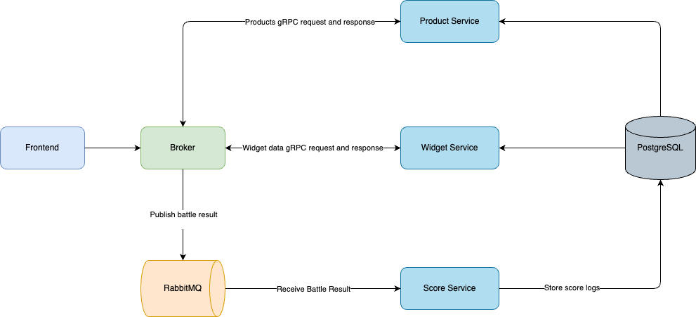

# Product Battle
## 目錄
- [簡介](#簡介)
- [動機](#動機)
- [系統架構](#系統架構)
- [建置步驟](#建置步驟)
- [系統入口](#系統入口)

## 簡介
Product Battle 是一個商品對決系統，透過逐輪一對一的淘汰賽機制，計算商品得分，並且視覺化各個產品的熱門度

## 動機
透過開發行銷主題的小遊戲，熟悉 Microservices 與 Go, Gin, gRPC, RabbitMQ, PostgreSQL 和 Docker 的應用

## 系統架構
| Service          | 說明         |
|------------------|---------------------|
| `frontend`       | 商品對決介面、數據儀表板|
| `broker`         | 微服務 API gateway|
| `product-service`| 提供商品資料|
| `score-service`  | 處理分數計算與儲存|
| `widget-service` | 提供儀表板數據|

架構圖：


## 建置步驟
### 1. 複製環境設定
執行以下指令，並根據需求修改 `.env` 檔案中的帳號與密碼：
```
cp .env.example .env
```

### 2. 啟動服務
使用 Docker Compose 啟動所有服務：
```
docker compose up -d
```

### 3. 資料庫遷移
執行資料庫遷移，請記得將指令中的帳號與密碼替換為您設定的值：

```
brew install golang-migrate

migrate -path product-service/internal/infra/db/migrations -database "postgres://<username>:<password>@localhost:54317/product?sslmode=disable" up

migrate -path score-service/internal/infra/db/migrations -database "postgres://<username>:<password>@localhost:54317/score?sslmode=disable" up
```

### 4. 新增商品資料
請依需求新增商品資料，確保系統能正常運作。


## 系統入口

| Service       | URL                                                                |
|---------------|--------------------------------------------------------------------|
| `Frontend`  | [http://localhost:8080](http://localhost:8080) |
| `Dashboard` | [http://localhost:8080/dashboard](http://localhost:8080/dashboard) |
| `RabbitMQ`  | [http://localhost:15672](http://localhost:15672) |